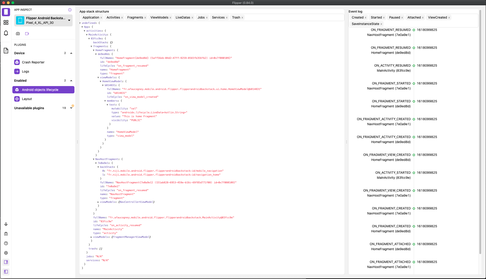

# Android Object LifeCycle / BackStack Flipper Plugin 

## What you get

This Flipper plugin is an app introspection plugin focus on Android Sdk mains objects and their life cycle.

It enable to see the "big internal picture" of your running app in a side tool. Meaning that :
 - trough running the app as a user
 - you can kee an eye on internals as a developer

## Status

The plugin is under development
Name is not sealed (ideas are welcome)

## Availability

You can get the Android plugin with the Gradle dependency from Jitpack
- https://jitpack.io/#afaucogney/flipper-backstack

## Content

### Left part 

You can :

- see the app object structure
 - application
 - activities
 - fragments
 - viewModels (with reflexion)
 - viewModel members (liveDatas) (with reflexion)
 - jobs (not yet available)
 - services (not yet available)
 - trash (objects destroyed)
 - backstack (legacy)
 - backstack (jetpack navigation)
 
 The object structure is view as a tree, where each instance of an object has is dedicated object category.
 
 - `HomeFragment` parent is `fragments`
 - `HomeFragment` children are running instances of `HomeFragment`
    
- filter objects in the tree (not yet available) 

### Right part

You can :

- see the object lifeCycle events for
  - activities
  - fragments

- filter those event categories 
 - created/destroyed
 - started, stopped
 - paused, resumed
 - attached/ detached
 - ViewCreated
 - SaveInstanceState     

## Installation

### Android

Add it in your root build.gradle at the end of repositories:

	allprojects {
		repositories {
			...
			maven { url 'https://jitpack.io' }
		}
	}
Step 2. Add the dependency

	dependencies {
	        implementation 'com.github.afaucogney:flipper-backstack:b1329a419a'
	}

### Flipper Desktop

Install the plgin in Flipper, it is called `lifecycle` [Npm page](https://www.npmjs.com/package/flipper-plugin-lifecycle)

## What can you achieve with the plugin 
 
 - identify runtime object instances and structure
 - identify leaks (remaining objects)
 - identify bug instantiations (recreation Vs preservation)
 - understand architecture in a breeze
 - see object instantiation in real time
 - lifeCycle issues
 - backStack issues

## TODO

- [ ] Be able to filter object in structure
 - [ ] Save option in client (duplex)
 - [ ] Impact event filtering from object
- [ ] Evaluate saving data in db / shareprefs
- [ ] Handle clean versioning / release
- [ ] Generate docs
- [ ] Embed Desktop Code Source here 
- [ ] Impl Jobs
- [ ] Impl Services
- [ ] See bundle / saveinstance state
- [ ] See App lifecycle

 

 
 